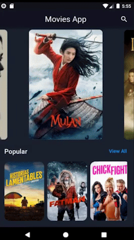
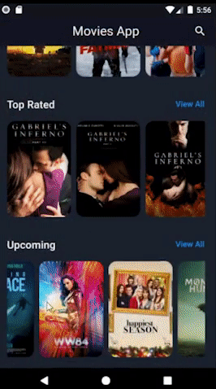
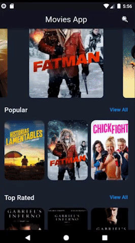

# Movies App

A Flutter project to search for latest, upcoming and trending movies and view their details. 🎬🍿

## Learning Objectives

- [x] Learned how to fetch data from REST API
- [x] Learned how to display and load images from URL, add BackDropFilter to images, and how to manage if no image if returned
- [x] Practice Flutter as always :laughing:

&nbsp;
## Future improvements

- [ ] Add local database to store user's wishlist and watched movies.

&nbsp;
## Screenshots

| 	|  	|  	|  	|
|---	|---	|---	|---	|

## Getting Started
### Prerequisites

Register at [TMDB](https://developers.themoviedb.org/3) , create and add your API Key to the project in the file `lib/api/api_key.dart.dist` and then remove the `.dist` file extension.

Flutter and Android Studio should be installed and properly configured. 

To check proper installation:

```
cmd> flutter doctor -v
```

### Run

To run the project, simply run `pub get` and `flutter run` to run project on any emulator.

&nbsp;
## Built With [Flutter](http://www.flutter.dev) 

## Authors
* **M. Qasim Siddiqui** - [qasimsiddiqui](https://github.com/qasimsiddiqui)